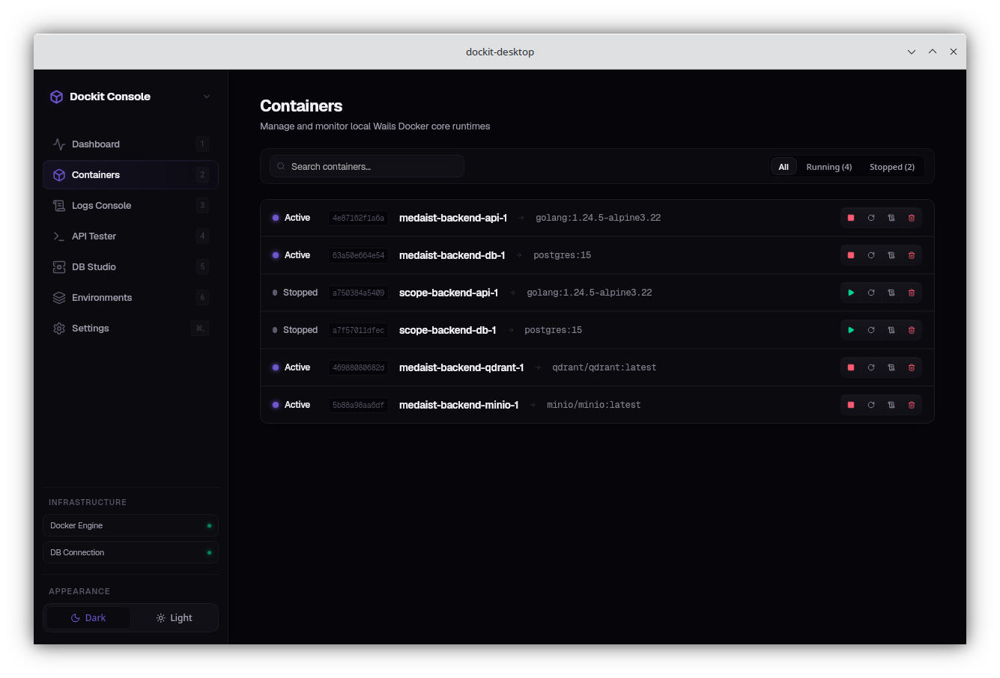
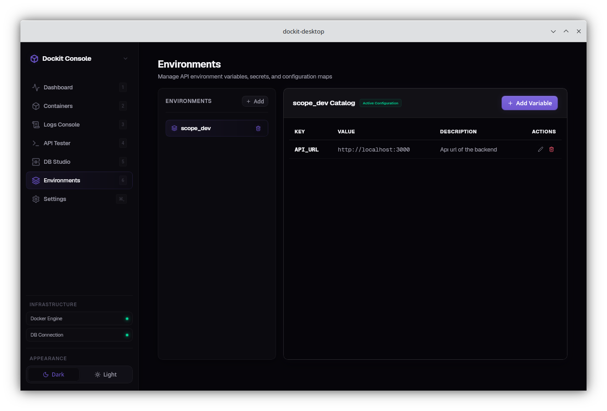

# 🐳 WhaleDesk Desktop

<p align="center">
  <strong>A modern, unified desktop application for managing Docker resources, testing APIs, and managing databases.</strong>
</p>

<p align="center">
  <a href="https://wails.io/"></a>
  <a href="https://go.dev/"></a>
  <a href="https://reactjs.org/"></a>
  <a href="https://opensource.org/licenses/MIT"></a>
</p>

---

## 📋 Table of Contents

- [✨ Overview](#-overview)
- [🌟 Key Features](#-key-features)
- [📸 Screenshots](#-screenshots)
- [🚀 Quick Start](#-quick-start)
- [🏗️ Build](#️-build)
- [📖 Usage Guide](#-usage-guide)
- [🔒 Data and Security](#-data-and-security)
- [📁 Project Structure](#-project-structure)
- [🛠️ Troubleshooting](#️-troubleshooting)
- [❓ FAQ](#-faq)
- [🤝 Contributing](#-contributing)
- [📄 License](#-license)

## ✨ Overview

WhaleDesk Desktop brings common devops and API tasks into a single, beautifully designed desktop UI:

- **Monitor** Docker daemon health and container status
- **Manage** containers (Start, stop, restart, and remove)
- **Test APIs** with environment variable interpolation
- **Review** API request history easily
- **Manage Databases** (PostgreSQL) - browse schemas, tables, and run SQL queries

## 🌟 Key Features

- 🐳 **Docker Dashboard**: Live daemon status, container counts, and quick stats.
- 📦 **Container Manager**: Lifecycle actions and live status badges.
- 🌐 **API Tester**: JSON payloads, response preview, and dynamic variable injection.
- 🗄️ **Database Logs**: Local request history stored efficiently in SQLite.
- 🐘 **DB Manager**: PostgreSQL connections, schema browsing, and native SQL execution.
- 🔐 **Encrypted Secrets**: Environment variable values are heavily encrypted at rest.

## 📸 Screenshots

<details>
<summary><b>View Dashboard</b></summary>
<br>

</details>

<details>
<summary><b>View Containers</b></summary>
<br>

</details>

<details>
<summary><b>View API Tester</b></summary>
<br>

</details>

<details>
<summary><b>View DB Manager</b></summary>
<br>

</details>

<details>
<summary><b>View Environments</b></summary>
<br>

</details>

## 🚀 Quick Start

### Prerequisites

- **Go 1.25+**
- **Node.js 18+** & npm
- **Wails CLI**: `go install github.com/wailsapp/wails/v2/cmd/wails@latest`
- **Docker Engine** or Docker Desktop (required for Docker pages)
- **PostgreSQL Server** (optional, for DB Manager)

### Install Frontend Dependencies

```bash
npm install --prefix frontend
```

### Run in Development

```bash
wails dev
```

> _This starts Vite and the Wails dev server. You can access devtools at `http://localhost:34115`._

## 🏗️ Build

To build the application for your OS:

```bash
wails build
```

Optional frontend-only build:

```bash
npm run build --prefix frontend
```

## 📖 Usage Guide

### 🐳 Docker

- Make sure Docker is running locally. The **Dashboard** shows daemon status.
- The **Containers** page allows quick start/stop/restart/remove actions.

### 🌐 API Tester

- Use the API Tester to send requests and inspect responses.
- If an environment is active, `{{variable}}` placeholders are automatically resolved on the backend.

### 🌿 Environments

- Create named environments (e.g., _Dev, Staging, Prod_).
- Add variables and mark sensitive values as secret.
- Secrets are encrypted and safely masked in the UI.

### 🐘 DB Manager

- Only **PostgreSQL** is supported for now.
- Default SSL mode is `prefer` if left empty.
- Use host, port, user, and database values that are reachable from your local machine.

## 🔒 Data and Security

- Local data is stored in `whaledesk.db` (SQLite) in the project root.
- SQLite WAL files (`whaledesk.db-wal`, `whaledesk.db-shm`) are expected during use.
- Environment variables are encrypted at rest using **AES-256-GCM**.
- The encryption key is stored securely in the **OS keyring** and never written to disk in plaintext.

## 📁 Project Structure

```text
whaledesk-desktop/
├── main.go               # Wails app entrypoint
├── app.go                # App lifecycle wiring
├── bindings/             # Wails bindings exposed to the frontend
├── internal/
│   ├── domain/           # Core models
│   ├── ports/            # Interfaces
│   ├── usecase/          # Business logic
│   └── infrastructure/   # Adapters (Docker, SQLite, Crypto, DB Manager)
└── frontend/             # React UI (Vite)
```

## 🛠️ Troubleshooting

- **Docker pages show offline**: Verify Docker is running with `docker info`.
- **DB Manager cannot connect**: Check host/port/firewall and PostgreSQL user access.
- **Keyring errors on Linux**: Ensure a keyring service (e.g., `gnome-keyring`) is running.
- **Build fails**: Run `gofmt -w ./...` and `npm install --prefix frontend` again.

## ❓ FAQ

**Q: Is this a server app?**  
**A:** No. WhaleDesk Desktop is a local desktop UI that uses local Docker and local data.

**Q: Where are API logs stored?**  
**A:** In the local SQLite file `whaledesk.db`.

**Q: Are environment secrets safe?**  
**A:** Yes. Secrets are encrypted at rest. The encryption key is stored safely in your OS keyring.

## 🤝 Contributing

We love contributions! Please see [`CONTRIBUTING.md`](CONTRIBUTING.md) for development details and contribution guidelines.

## 📄 License

This project is licensed under the MIT License - see the `LICENSE` file for details.
